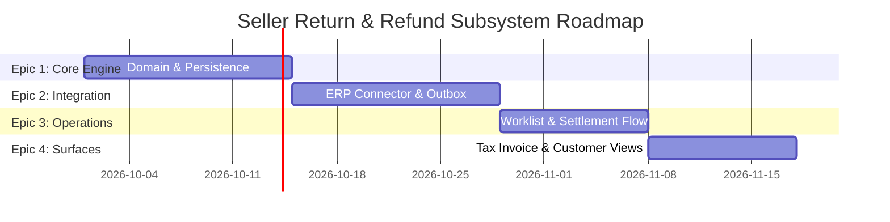

# 02 - Refund Design

This document presents the end-to-end seller refund architecture design (Part 2A):
1. **End-to-End Sequence Diagram** detailing actors, persistence boundaries, and failure handling.
2. **Phased Delivery Plan** organized at epic granularity with explicit dependencies and acceptance gates.

---

## 1. End-to-End Refund Flow Sequence Diagram

The diagram below maps the complete lifecycle of a seller refund from initial CS operator submission through database transaction boundary, async outbox execution, ERP credit note registration, offline cash transfer, read-before-confirm verification, and final settlement export.

```mermaid
sequenceDiagram
    autonumber
    actor CS as CS Operator (Refund Role)
    participant UI as Admin Refund UI (Knockout/JS)
    participant Ctrl as Save Controller / Processor
    participant DB as MariaDB (mp_refund / items / events)
    participant Outbox as DB Outbox / Dispatcher
    participant ERP as ERP Refund API Stub
    actor Fin as Finance Team (Offline Bank)
    participant Export as Settlement Adjustment Export

    %% Phase 1: Creation & Local Commit (BR-06)
    rect rgb(240, 248, 255)
        note right of CS: 1. Refund Entry & Submission
        CS->>UI: Select seller lines & quantities, click Submit
        UI->>UI: Lock submit button (inFlight=true)
        UI->>Ctrl: POST /admin/acme_refund/refund/save (order_id, items, reason)
        Ctrl->>DB: Acquire pessimistic lock on order (OrderLock)
        Ctrl->>Ctrl: Validate (BR-01 eligibility, BR-02 14-day window, BR-03 line qty)
        alt Validation Failure
            Ctrl-->>UI: 400 Bad Request (Validation Exception)
            UI-->>CS: Display user-safe error message, unlock button
        end
        Ctrl->>Ctrl: Calculate money & tax (RefundTotalCalculator)
        Ctrl->>DB: BEGIN TRANSACTION
        Ctrl->>DB: INSERT mp_refund (status=calculated, create_status=not_started)
        Ctrl->>DB: INSERT mp_refund_item (lines)
        Ctrl->>DB: INSERT mp_refund_event (created)
        Ctrl->>DB: INSERT outbox (op=create, status=pending)
        Ctrl->>DB: COMMIT TRANSACTION
        Ctrl-->>UI: 200 OK (refund_id, refund_no, status=calculated)
        UI-->>CS: Display "Saved; ERP notification pending retry"
    end

    %% Phase 2: Async ERP Create Refund (BR-06, BR-07)
    rect rgb(255, 250, 240)
        note right of Outbox: 2. Outbox Execution: Create Refund
        Outbox->>DB: Claim pending CREATE job (pessimistic row lock)
        Outbox->>ERP: POST /erp-api/v1/refunds (Header: refund_no)
        
        alt Transient Failure (HTTP 503 / 429 / Timeout)
            ERP-->>Outbox: 503 Service Unavailable / Timeout
            Outbox->>DB: UPDATE mp_refund (create_status=retryable_error)
            Outbox->>DB: INSERT mp_refund_event (transient error logged)
            Outbox->>DB: Reschedule outbox job with exponential backoff
        else Business Rejection (HTTP 400 / 422)
            ERP-->>Outbox: 422 Unprocessable Entity
            Outbox->>DB: UPDATE mp_refund (status=failed, create_status=business_rejected)
            Outbox->>DB: INSERT mp_refund_event (terminal error)
            Outbox->>DB: Mark outbox job dead
        else Success (HTTP 200 / 201)
            ERP-->>Outbox: 200 OK { erp_refund_id: "ERP-8000123", status: "refund-pending" }
            Outbox->>DB: UPDATE mp_refund (status=cash_refunded_pending, create_status=succeeded, erp_refund_id)
            Outbox->>DB: INSERT mp_refund_event (create succeeded)
            Outbox->>DB: Mark outbox job succeeded
        end
    end

    %% Phase 3: Offline Cash Refund Registration (BR-10)
    rect rgb(245, 255, 250)
        note right of Fin: 3. Cash Transfer & Registration
        Fin->>Fin: Perform offline bank transfer to customer
        Fin->>CS: Provide bank txn number & date
        CS->>UI: Open Refund Worklist, enter txn details, click "Register Cash Refund"
        UI->>Ctrl: POST /admin/acme_refund/refund/cashRegister (refund_id, txn_no, date)
        Ctrl->>DB: UPDATE mp_refund (status=cash_refunded, cash_refund_status=succeeded, txn_no, date)
        Ctrl->>DB: INSERT mp_refund_event (cash_registered)
        Ctrl->>DB: INSERT outbox (op=status_check, status=pending)
        Ctrl-->>UI: 200 OK (status=cash_refunded)
        UI-->>CS: Display "Cash Refund Registered"
    end

    %% Phase 4: Read-Before-Confirm & ERP Settlement (BR-08, BR-10)
    rect rgb(255, 245, 245)
        note right of Outbox: 4. Read Refund Status & Settlement Confirmation
        Outbox->>DB: Claim pending STATUS_CHECK job
        Outbox->>ERP: GET /erp-api/v1/refunds/{erp_refund_id}
        ERP-->>Outbox: 200 OK { status: "refund-pending" }
        Outbox->>DB: UPDATE mp_refund (status=erp_confirm_pending, status_check_status=succeeded)
        Outbox->>DB: INSERT outbox (op=confirm, status=pending)

        Outbox->>DB: Claim pending CONFIRM job
        Outbox->>ERP: POST /erp-api/v1/refunds/{erp_refund_id}/confirm (Header: erp_refund_id)
        ERP-->>Outbox: 200 OK { status: "refund-confirmed" }
        Outbox->>DB: UPDATE mp_refund (status=erp_confirmed, confirm_status=succeeded)
        Outbox->>DB: INSERT mp_refund_event (erp_confirmed)
        Outbox->>DB: Trigger Settlement Adjustment Export & Email Notification
        Outbox->>Export: Publish refund settlement record to Seller Ledger
    end
```

---

## 2. Phased Delivery Plan (Epic Granularity)

The implementation is structured into four sequential epics. Each epic defines clear entry criteria, core deliverables, and strict acceptance gates.



---

### Epic 1 — Core Domain Engine & Transactional Persistence
* **Objective:** Establish the foundational data model, money/tax calculation rules, server-side validation, and transactional persistence.
* **Dependencies:** None.
* **Deliverables:**
  * Schema migrations for `mp_refund`, `mp_refund_item`, `mp_refund_event`, and `mp_refund_outbox`.
  * `RefundTotalCalculator` supporting exact BCMath 4-decimal precision, Japanese consumption tax (10%, 8%, 0%), and seller shipping pro-rata allocation.
  * `RefundValidator` enforcing BR-01 (seller line filtering), BR-02 (14-day eligibility window), and BR-03 (per-line quantity bounds).
  * `OrderLock` pessimistic locking mechanism to enforce BR-05 (one active refund per order).
* **Acceptance Gates:**
  * 100% unit test coverage on financial math, edge cases (zero shipping, multi-rate tax), and validation guards.
  * Integration test proving database commit succeeds and rolls back atomically on error without external HTTP calls.

---

### Epic 2 — ERP Integration & Resilient Outbox Messaging
* **Objective:** Connect the store to the ERP Refund API stub via a durable outbox queue with exponential backoff retries and audit logging.
* **Dependencies:** Epic 1 complete.
* **Deliverables:**
  * `ErpRefundClient` wrapping `Create Refund`, `Read Refund Status`, and `Confirm Refund` HTTP calls with strict connect/read timeouts.
  * `Outbox` table and `Dispatcher` cron/CLI worker supporting `claim`, `reschedule` (exponential backoff with jitter), and `dead` (attempt cap).
  * `TaxCodeResolver` mapping local EAV attribute option values (`store_id = 0`) to stable business tax codes (`010`, `008`, `999`).
  * `EventRecorder` providing redacted payload append-only audit trail (`mp_refund_event`).
* **Acceptance Gates:**
  * Automated integration test demonstrating that transient 503/timeout errors leave `status = calculated`, update `create_status = retryable_error`, and auto-recover on subsequent outbox runs.
  * Proof that Create Refund idempotency header (`refund_no`) prevents duplicate credit notes on retries.

---

### Epic 3 — Operator Worklist & Offline Cash Settlement Workflow
* **Objective:** Deliver the Magento Admin UI screens for Customer Support operators and Finance registration.
* **Dependencies:** Epic 2 complete.
* **Deliverables:**
  * Knockout.js refund submission form (`refund-form.js`) with server-side recalculation and submit locking (`inFlight`).
  * Admin Refund Worklist Grid supporting fast pagination (<1.5s at 250k order volume) and status sub-filtering.
  * Cash refund registration modal and handler recording bank transaction reference and date.
  * Magento ACL permissions gating create, cash-register, retry, and audit log access across CS and Finance roles.
* **Acceptance Gates:**
  * Load test demonstrating worklist first-page render <1.5s under 40 concurrent operator sessions.
  * End-to-end integration test validating the lifecycle transitions: `calculated` → `cash_refund_pending` → `cash_refunded` → `erp_confirm_pending` → `erp_confirmed`.

---

### Epic 4 — Customer-Facing Presentation & Qualified Tax Invoice Surfaces
* **Objective:** Expose refunded amounts on customer-facing channels and push canonical refund records downstream.
* **Dependencies:** Epic 3 complete.
* **Deliverables:**
  * Reissued Receipt PDF generator (`RefundReceipt.php`) adhering to Japanese Qualified Tax Invoice layout (pre-refund header, refund breakdown, per-rate tax groups).
  * Customer account order details screen and order history summary views showing distinct pre-refund and refund breakdown blocks.
  * Async refund confirmation email trigger upon reaching `erp_confirmed`.
  * `SettlementAdjustmentExporter` pushing canonical refund records to the downstream seller settlement ledger.
* **Acceptance Gates:**
  * Visual and programmatic regression test verifying that all 5 presentation surfaces render identical financial totals derived from the stored snapshot.
  * Clean run of full integration test suite (`bin/assignment-test all`).

