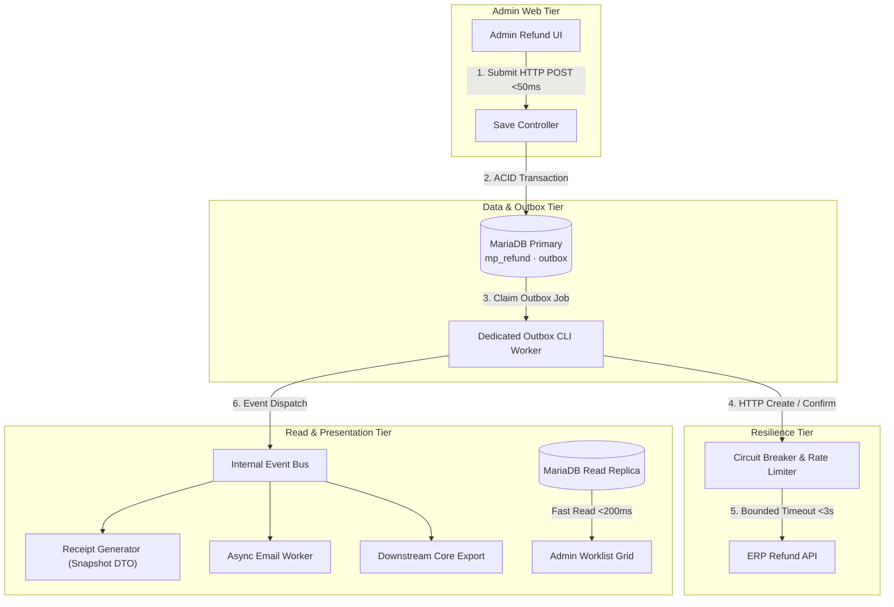

# 03 - Architecture Review

This document contains the critical review of the inherited architecture (Part 2B):
1. **Risk Analysis & Blast Radius Ranking** of the proposed v1 architecture.
2. **Target-State Extension** detailing how to take the subsystem to production scale.
3. **Pre-Sign-off Verification Facts & Technical Questions** to resolve before production deployment.

---

## 1. Inherited Architecture Risk Analysis

The inherited architecture overview proposes a single-request, synchronous design with client-side polling and channel-specific presentation logic. Below is the risk assessment ranked by operational blast radius:

| Rank | Severity | Risk Area | Root Cause | Operational Blast Radius | Mitigation Strategy |
|---|---|---|---|---|---|
| **1** | **CRITICAL** | **Web Worker Pool Exhaustion via Synchronous HTTP** | `RefundController::execute` calls ERP Create Refund synchronously inside the admin HTTP request. | If ERP latencies spike or time out (30s timeout), PHP-FPM web workers block. 40 concurrent operators will exhaust the web pool, causing HTTP 504 gateway timeouts across the entire storefront. | Enforce asynchronous execution via DB Outbox pattern. HTTP POST only writes to DB and enqueues outbox job (<50ms). |
| **2** | **HIGH** | **Database Lock Contention & Polling Overhead** | Admin UI polls status endpoint every 2 seconds across 40 concurrent sessions (1,200 reqs/min). | High SELECT query load on MariaDB; locks `mp_refund` rows during outbox updates, degrading primary DB write throughput and worklist response time. | Replace 2s HTTP polling with Server-Sent Events (SSE), WebSockets, or increase poll interval to 15s with exponential backoff on active UI. |
| **3** | **HIGH** | **Settlement Sweep Table Scans** | Settlement batch scans `cash_refunded` records without compound indexes on `(status, created_at)`. | As table grows beyond 20k rows, daily settlement queries perform full table scans, locking rows and causing DB CPU spikes during peak trading hours. | Add compound BTREE indexes: `(status, created_at)` and `(seller_order_id, status)`. |
| **4** | **MEDIUM** | **Con-currency Guard Defect (BR-05)** | Single refund per order guard enforced only in PHP memory rather than DB transaction isolation. | Simultaneous submissions from two operators or browser retry race conditions can bypass PHP checks and insert duplicate refund records. | Implement MySQL pessimistic `FOR UPDATE` lock on `sales_order` or a UNIQUE database constraint on `(order_id, status)` for active states. |
| **5** | **MEDIUM** | **Presentation Financial Logic Drift** | Five presentation surfaces (PDF, Account, Email, History, Export) independently compute totals. | Risk of subtle rounding discrepancy (e.g. JPY fractional tax calculation) between invoice PDF, customer email, and ERP export. | Mandate `RefundTotalCalculator` / stored snapshot as the single unified DTO provider for all presentation layers. |

---

## 2. Target-State Production Architecture

To scale to 250,000 monthly orders, campaign peaks of 25 submissions/minute, and 40 concurrent operators without risking storefront availability, the target state refines the architecture around four core pillars:

### Key Architectural Extensions

1. **Strict Asynchronous Outbox Decoupling:**
   * The HTTP POST `save` action *only* executes local DB validation, calculates figures, inserts `mp_refund` and an `outbox` row, and returns immediately (<50ms).
   * Background CLI daemon workers (`bin/magento acme:refund:outbox:consume`) process outbox jobs asynchronously. PHP-FPM web workers are never blocked by external HTTP requests.

2. **Connector Circuit Breaker & Rate Limiting:**
   * Wrap `ErpRefundClient` with a Guzzle Middleware Circuit Breaker (e.g., trip to Open state after 5 consecutive 5xx errors or timeouts within 60s).
   * Implement token-bucket rate limiting (matching ERP capacity of ~25 reqs/min) to prevent upstream denial-of-service during post-campaign refund bursts.

3. **Read-Replica Offloading for Worklist & Settlement:**
   * Direct Admin Worklist grid queries and daily settlement batch scans to a MariaDB Read Replica using Magento's multi-resource connection configuration (`sales_replica`).
   * Add required BTREE indexes on `mp_refund`:
     * `IDX_MP_REFUND_STATUS_CREATED` (`status`, `created_at`)
     * `IDX_MP_REFUND_ORDER_STATUS` (`order_id`, `status`)

4. **Unified Presentation DTO & Snapshot Immutability:**
   * All presentation layers (PDF invoice, email template, customer account, core export) consume a frozen `RefundSnapshotDTO` populated directly from `mp_refund_item` rows.
   * Eliminates dynamic recalculation on view rendering, guaranteeing 100% financial consistency across all customer and legal touchpoints.

---

## 3. Pre-Sign-off Verification & Technical Questions

Before granting architectural sign-off for production deployment, the following facts must be empirically verified and open technical questions resolved with domain stakeholders:

### Facts to Verify
1. **ERP Stub / Live SLA & Rate Limits:** Verify exact upstream HTTP timeout bounds (currently set to 3s connect / 5s read) and maximum allowed requests-per-second before HTTP 429 is triggered.
2. **Database Connection Pool Sizing:** Confirm MariaDB `max_connections` and thread pool settings accommodate background outbox workers alongside peak web worker traffic.
3. **Japanese Consumption Tax Rounding Rules:** Confirm whether tax rounding mode across all seller items is strictly `ROUND_HALF_UP` or `FLOOR` at the line item level per National Tax Agency rules.
4. **File Storage Resilience:** Confirm whether reissued PDF receipts are stored on distributed object storage (S3 / MinIO) or generated ephemerally on demand from stored snapshot data.

### Clarifying Questions for Stakeholders

#### For ERP & Finance Leads:
* **Q1:** If a Create Refund call succeeds in ERP but the HTTP response drops before reaching the store, ERP holds state `refund-pending`. When the store retries using `refund_no`, does ERP return `200 OK` with the existing `erp_refund_id`, or `409 Conflict`?
* **Q2:** What is the maximum SLA window between Finance registering the bank transfer and the ERP closing the credit note? Is there a timeout after which an unconfirmed credit note auto-cancels in ERP?

#### For Customer Support Operations:
* **Q3:** In cases of partial refund, can an operator issue *multiple successive partial refunds* against the same order over time (up to the remaining quantity limit), or is only one partial refund permitted per order lifetime?
* **Q4:** When an order delivery date is missing from the fulfillment feed, should CS operators be completely blocked from issuing a refund, or is there an escalated approval path for manual override?

---

## 4. Architectural Decision Records (ADR Summary)

* **ADR 01: Outbox over Inline HTTP Processing**  
  * *Decision:* Reject synchronous HTTP calls in Admin save controller; adopt DB Outbox pattern.  
  * *Rationale:* Protects web worker availability and guarantees zero lost refunds on network failures.
* **ADR 02: Immutable Snapshot Persistence**  
  * *Decision:* Freeze all money, tax rate, SKU, and unit price values into `mp_refund_item` at creation.  
  * *Rationale:* Protects legal tax invoice integrity against subsequent product catalogue or tax rule changes.

